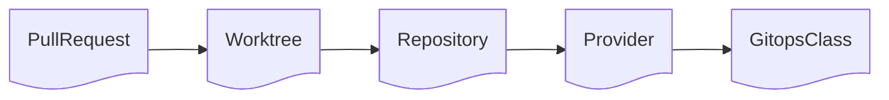

# Hermaeus Gitops Engine Component

Hermaeus Gitops Engine Component (HEGEC) is a boilerplate sidecar container handling git operation for gitops tools.

## Architecture

### Custom Resource Definitions

HEGEC manages multiple CRDs. Depending on the context, the resources can be created manually, or by the service itself or even by a third party service.

#### GitopsClass

> Cluster resource

Defines a group of gitops resources managed by one instance of HEGEC. There's one leader per class. Typically, there's one class per tool.

**Key properties**

- `name` — Name of the class. Used by the HEGEC instances to select the class.
- `leader.reportPeriod` — Duration between two update of the leader status fields by the leader.
- `leader.reelectionTimeout` — Duration before triggering a new leader election.

**Key status**

- `leader.name` — Leader name (`<namespace>/<pod_name>`)
- `leader.status` — Status of the leader situation.
  - `healthy` means the leader is answering and perform its tasks
  - `unhealthy` means the leader has not reported its status for a while, and it was detected by another instance. This status will trigger a new election.
  - `missing` means there is no leader and a new one must be elected.
- `leader.lastReport` — Field periodically updated by the leader.

#### Provider

> Namespaced

A remote git provider hosting the git repositories. Per example: Gitlab, GitHub, Codeberg, Forgejo, Gitea or even a bare git server.

This CRD centralized the configuration of the providers for all repositories.

**Key properties**

- `baseURI` — The base URI of the repository. Per example `github.com/hermaeus-project`
- `gitopsClassName` — Name of the class the repository belongs too.
- `git.ssh` — SSH configuration. This block is mutually exclusive with other `git` blocks.
  - `git.ssh.secret.name` — Name of the secret where the secret key is. Secret must be in the same namespace.
  - `git.ssh.secret.key` — Key in the secret containing the private SSH key.
- `git.http` — HTTP(S) configuration. This block is mutually exclusive with other `git` blocks.
  - `git.http.secure` — Boolean enforcing secure HTTPS connection.
  - `git.http.basicAuth` — Basic authentication block
  - `git.http.basicAuth.secret.name` — Name of the secret where the authentication is. Secret must be in the same namespace.
  - `git.http.basicAuth.secret.usernameKey` — In the secret, username key.
  - `git.http.basicAuth.secret.passwordKey` — In the secret, password key.
- `service.gitlab` — Block configuring Gitlab service provider. Mutually exclusive with other providers.
- `service.github` — Block configuring GitHub service provider. Mutually exclusive with other providers.
- `service.forgejo` — Block configuring Forgejo service provider. Mutually exclusive with other providers.
- `service.gitea` — Block configuring Gitea service provider. Mutually exclusive with other providers.

#### Repository

> Namespaced

Defines a remote repository to manage. 

**Key properties**

- `providerRef` — A reference to a Provider resource
- `path` — Path to append to the URI of the provider. Often the name of the repository.

#### Worktree

> Namespaced

A git worktree (commit, branch or tag) to keep locally.

**Key properties**

- `repositoryRef` — A reference to a Repository resource
- `ref.branch` — Name of the branch to checkout. Mutually exclusive with `tag` and `commit`
- `ref.tag` — Name of the tag to checkout. Mutually exclusive with `branch` and `commit`
- `ref.commit` — SHA of the commit to checkout. Mutually exclusive with `tag` and `branch`

#### PullRequest

> Namespaced

Proxy data of a PullRequest managed by HEGEC.

**Key properties**

- `sourceWorktreeRef` — A reference to the source worktree resource. Must be a branch worktree.
- `destinationWorktreeRef` — A reference to the destination worktree resource. Must be a branch worktree.

## Leader

### Role

The leader carries the responsibility of garbage collecting unused CRDs. It checks if 

### Election

The first to set the GitopsClass status is elected leader (guess it's not really an election then).